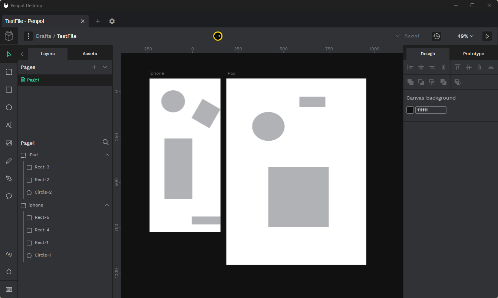

# penpot-desktop

**Archived for other, better alternatives existing. Check out [KorbsStudio's Penpot-Desktop](https://sudovanilla.com/code/Korbs/Penpot-Desktop) for more details**

Simple wrapper application for penpot

## Setup
- Clone this repo
- Run `npm install`
- Run `npm run dev`

## Build
- Run `npm run build`
